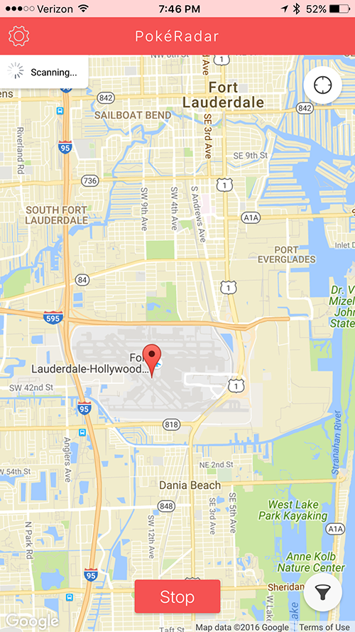
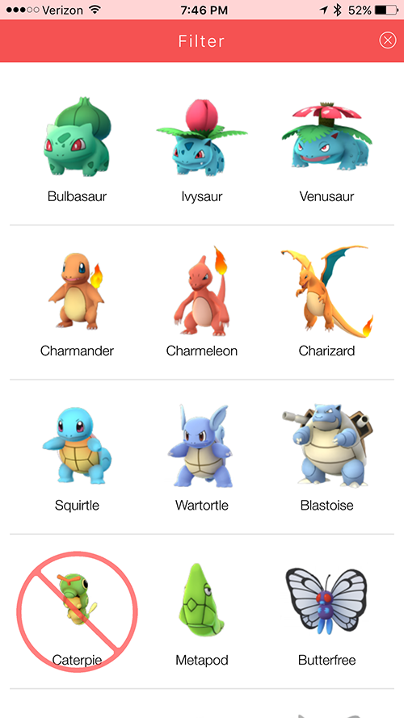

# PokeRadar
-- Currently Down -- server isn't running to make api calls

Ionic app using pokemongoMap api to scan for Pokemon in specified location with filters.

Before running:
    > npm install

Run App:
	- Local Browser:
		> ionic serve
	- Android Emulator:
		> ionic build android
		> ionic emulate android
	- iOS Emulator:
		> ionic build ios
		> ionic emulate ios
	- Device:
		> ionic run ios
		> ionic run android

Screenshots:

